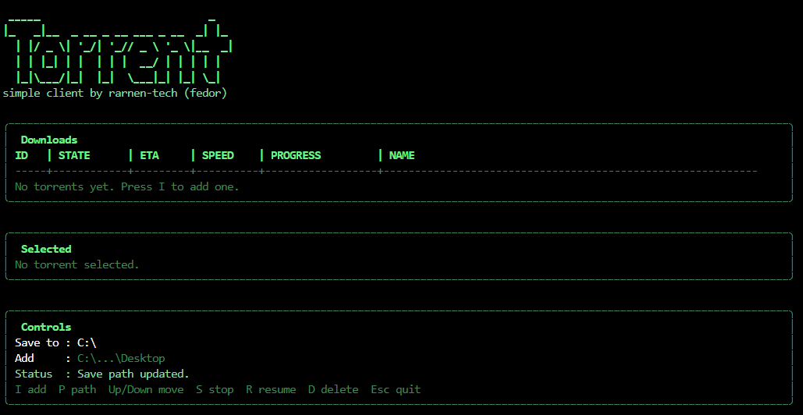

[English edition](./README.md)
# go-torrent-cli

Небольшой торрент-клиент в CLI на Go.


## Что используется?

- Redis для текущего состояния загрузки.
- PostgreSQL готов в docker compose на получение будущих данных.

## Быстрый старт

1. Установите [Go 1.25+](https://go.dev/doc/install)
2. Установите [Docker Desktop](https://www.docker.com/products/docker-desktop/)
3. Установите [`make`](https://gnuwin32.sourceforge.net/packages/make.htm)
4. Сервисы запуска:

```bash
make up
```

5. Запустить клиент:

```bash
make run
```

## Главные команды

```bash
make up
make down
make restart
make logs
make ps
make run
make build
make test
make clean
```

## Как это работает

- `make up` запускает Redis и PostgreSQL (для будущих реализаций) из `docker-compose.yml`.
- Приложение использует Redis на `127.0.0.1:6379` по умолчанию.
- Если Redis не будет готовым, приложение продолжит работу, но статусы будут храниться только в памяти.

## Запуск приложения

```powershell
go run .\cmd\app\main.go
```

## Добавить torrent сразу

```powershell
go run .\cmd\app\main.go C:\path\movie.torrent
```

## Добавить magnet сразу

```powershell
go run .\cmd\app\main.go "magnet:?xt=..."
```

## Билд

Для Windows:

```powershell
go build -o .\bin\go-torrent-cli.exe .\cmd\app
```

Для Linux или macOS:

```bash
go build -o ./bin/go-torrent-cli ./cmd/app
```

Или через make:

```bash
make build
```

## Настройка Redis 

Для собственных настроек Redis используйте внешние переменные.

```powershell
$env:TORRENT_REDIS_ADDR="127.0.0.1:6379"
$env:TORRENT_REDIS_PASSWORD=""
$env:TORRENT_REDIS_DB="0"
$env:TORRENT_REDIS_PREFIX="go-torrent-cli"
```
